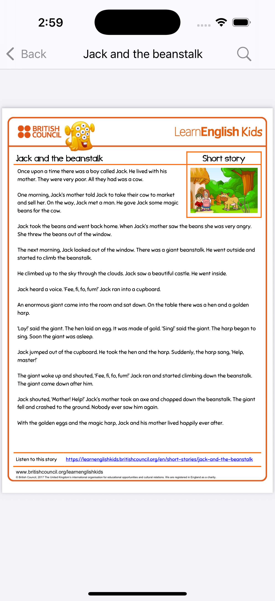
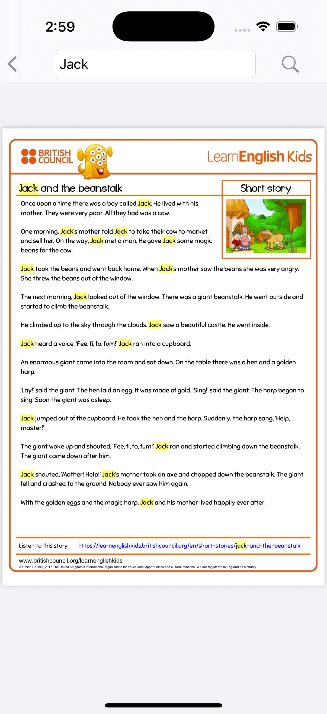

# Kids Area (MVP)

An educational iOS app designed for kids to explore and learn through interactive PDF reading, freeform drawing, and real-time object recognition using CoreML and Wikipedia. This app is built in SwiftUI and leverages powerful frameworks to provide a rich, accessible learning environment.

-------------

### Overview
KidsArea brings together three core modules to foster creativity and discovery:

1. **PDF Viewer**: Display educational PDFs with full-text search and highlighted results.
2. **Freeform Drawing**: A flexible drawing canvas powered by PencilKit, featuring multiple pen styles, colors, undo/redo, eraser, and more.
3. **Camera & Object Recognition**: Capture live scenes, detect objects using a CoreML model, and fetch descriptive information from Wikipedia.

-------------

### 🌟 Key Features
#### 📚 PDF Viewer
* **Full PDF Rendering**: Smooth page swiping and zooming via `PDFKit`.
* **Search & Highlight**: Instant text search with highlighted matches.
* **Thumbnail Navigation**: Quick jump to specific pages with a scrollable thumbnail bar.

#### ✏️ Freeform Drawing (Based On GetStream Drawing)
* **PencilKit Canvas**: UIKit-backed drawing view wrapped in SwiftUI.
* **Multiple Tools**: Select pen, marker, highlighter, and eraser tools.
* **Color Palette**: Choose from a vibrant set of colors.
* **Undo/Redo Stack**: Reverse or reapply strokes.
* **Save & Share**: Export drawings to the Photo Library or share via standard iOS share sheet.

#### 📷 Camera & Object Recognition
* **Live Camera Feed**: High-performance preview using `AVFoundation` and `AVCaptureVideoPreviewLayer`.
* **CoreML Detection**: Real-time object classification with a pre-trained model (e.g., MobileNetV2).
* **Wiki Integration**: Upon detection, fetch a summary from Wikipedia's REST API and display alongside the camera view.

-------------

## 📖 Usage Examples

### Search a PDF

1. Tap the 🔍 icon in the top toolbar of the PDF Viewer.
2. Enter a keyword; matching text is highlighted in yellow.
3. Navigate between results with the next/previous arrows.

### Draw on Canvas

1. Select a tool from the bottom toolbar (pen, marker, eraser).
2. Choose a color or thickness slider.
3. Draw with your finger or Apple Pencil.
4. Use ↩️ / ↪️ buttons to undo/redo strokes.

### Object Recognition

1. Go to the **Camera** tab.
2. Point the camera at an object.
3. Wait for the classification label to appear.
4. Tap **Learn More** to view a Wikipedia summary.

-------------

### 🔗 Libraries & Tools
* **PDFKit**: Native PDF rendering and annotation support.
* **PencilKit**: iOS drawing framework for rich sketching experiences.
* **AVFoundation**: Camera capture and preview layering.
* **CoreML & Vision**: On-device inference for object classification.
* **Combine**: Asynchronous data streams.
* **[Kingfisher](https://github.com/onevcat/Kingfisher.git)**: Image caching and async loading.
* **[Shimmer-SwiftUI-Modifier](https://github.com/0xYanis/Shimmer-SwiftUI-Modifier.git)**: Loading placeholders with shimmer effect.

### 📝 License
Distributed under the Apache License, Version 2.0. See the [LICENSE](LICENSE) file for details.

© 2025 OmAr-Kader. All rights reserved.

-------------

### Screenshot

<table>
    <tr>
      <td>  </td>
      <td>  </td>
    </tr>
    <tr>
      <td>  </td>
      <td>  </td>
    </tr>
    <tr>
      <td>  </td>
      <td>  </td>
    </tr>
</table>

-------------

### Screen Records

https://github.com/user-attachments/assets/2093ebe7-f208-4339-a45f-bd14c012b592

